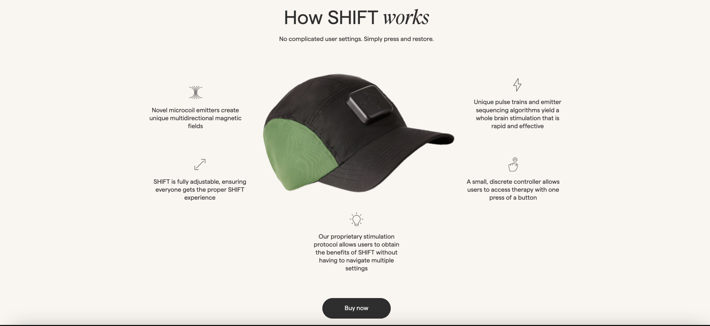

# Innovative Layout Sections Showcase

Welcome to the Innovative Layout Sections Showcase repository! This repository contains a collection of step-by-step guides and code examples to help you create captivating and interesting layout sections for your web projects. Each subdirectory represents a different layout concept, complete with code snippets, explanations, and visual demonstrations.

## About

Have you ever wanted to take your web design skills to the next level? This repository aims to inspire and guide you in crafting unique and engaging layout sections that stand out. Whether you're a beginner or an experienced developer, you'll find valuable insights and techniques to elevate your web design game.

## Repository Link

🔗 [Check out the Innovative Layout Sections Showcase](https://github.com/glody007/web-section-showcase.git)

## Subdirectories

Explore the various innovative layout sections in this repository:

1. [Product Centerpiece](./central-product-image-layout): Learn how to create a layout where a captivating product image takes the spotlight, surrounded by dynamic icons and engaging subtext.

Each subdirectory contains its own README with detailed instructions, code samples, and screenshots. Feel free to explore, experiment, and integrate these innovative layouts into your projects!

## Using Design Assets from Other Sources

Please note that some design assets used in this repository may have been sourced from external websites or creators. If you plan to use these assets in your projects, make sure to follow the licensing terms and attribution requirements specified by the original creators. Always respect the rights and permissions associated with each asset.

## Contributions

Contributions to this repository are welcome! If you have your own unique layout ideas or improvements to existing sections, feel free to create pull requests. Let's collaborate and inspire each other in the world of web design!

## License

This repository is licensed under the [MIT License](./LICENSE).
