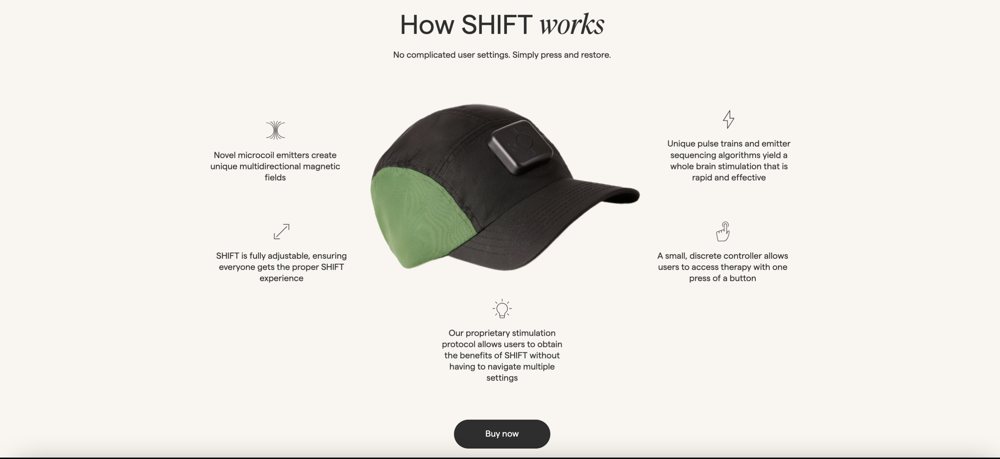

# Product Centerpiece

In this section, you have code samples to create a captivating layout where a product image takes the spotlight, surrounded by dynamic icons and engaging subtext. This layout is designed to draw attention to your product while providing additional information in an aesthetically pleasing way.

## Overview

The "Product Centerpiece" layout is a visually striking way to showcase a product on your website. By placing the product image at the center and surrounding it with icons and subtext, you can create an immersive and engaging user experience. This layout can be particularly effective for highlighting key features or benefits of your product.

## Key Features

- Captivating product image as the focal point.
- Dynamic icons that provide visual cues and enhance user understanding.
- Engaging subtext that offers additional context or information.
- A balanced composition that creates a harmonious design.
- Ensure responsive design to maintain the layout's effectiveness on various screen sizes.

## Preview 

